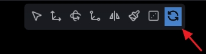

# PLY Quick Sync

<p align="center">
  
</p>

`PLY Quick Sync` is a plugin for [LichtFeld Studio](https://lichtfeld.io/) that adds a one-click toolbar button for quickly overwriting linked `.ply` files.

It is designed for workflows where you keep editing in LichtFeld Studio and want to quickly write changes back to the same `.ply` on disk.

## What it does

- adds a `Quick Sync` button to the top toolbar
- overwrites linked `.ply` files per node
- supports multi-selection without merging models into one file

## Warning

⚠️ When you run `Quick Sync`, the linked `.ply` file is overwritten in place.

If you do not want to lose the original source file, work on a copy or keep a backup before syncing.

## Installation (LichtFeld Studio v0.5+)

In LichtFeld Studio:

1. Open the `Plugins` panel.
2. Enter:

```text
https://github.com/OlstFlow/Lichtfeld-PLY-Quick_Sync-Plugin
```

3. Install the plugin.
4. Restart LichtFeld Studio if needed.

## Usage

1. Open a `.ply` scene in LichtFeld Studio.
2. Select one or more splat nodes.
3. Link the selected node to a target `.ply` file if needed.
4. Click `Quick Sync` in the top toolbar.

If multiple linked nodes are selected, each node is synced to its own linked `.ply` file separately.

## License

This plugin's code is released under `GPL-3.0-or-later`.
